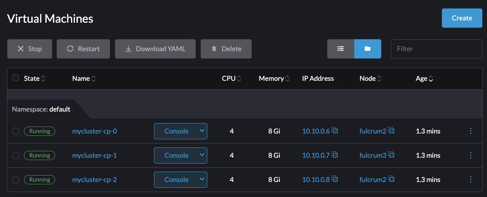

# RKE2 on Harvester via Helm and Packer (no Ansible, no Terraform, and no CAPI)

This repo will be built around describing the process for deploying an RKE2 cluster onto Harvester using a custom VM image (including the building of that VM image). This is a bit different than other methods in that it has greatly reduced dependencies. Benefits of this pattern:

* No IaC orchestrator dependency
* No Rancher MCM dependency
* No base/starter VM image necessary
* Airgap-friendly
* Ties into Prod-grade K8S deployments, Rancher included
* Minimal tool dependency (kubectl, helm, and a harvester installation)

## Order of Operations
The helm chart uses a base VM image to deploy RKE2 and so it has a dependency there. This means the VM needs to be built first and then deploy the chart.

* build packer image
* deploy VM image to harvester
* install helm chart with our chosen values

## Brief Helm mention
The helmchart will start as a simple PoC for deploying an RKE2 cluster onto Harvester directly without use of other infrastructure tools. This cluster will be of a static state and VM-based. If you need LCM capability of your cluster, this could be a starting point for your production Kubernetes clusters, but the Rancher MCM interface is significantly more rich and sophisticated.
[Helm Charts for Rancher MCM downstream clusters](https://github.com/rancherfederal/rancher-cluster-templates)

In a production-quality deployment, you might use a process just like this to bootstrap the first cluster from scratch in an airgap (also called `local` or `management` cluster) and then use the more rich Rancher/CAPI CRDs for creating more downstream managed clusters.

## Brief Packer mention
The packer code is located in the `packer/` directory. [Click here](packer/README.md) to view the Packer instructions.

FYI, the intention of this pattern fitting within an Airgap process is to either build the VMs outside the Airgap and migrate the images into your airgap OR build the VMs inside your airgap directly. Obviously, for the latter, this requires your OS-layer repositories to exist if using any packages not included on the official ISO release of your chosen OS. This demonstration will be for the former case, so the Packer step assumes you have internet access from your Harvester environment.

Packer can be a deep rabbit hole and thankfully the way Harvester's open source and open standard-backed approach works, it is very easy to build images for. Harvester uses KVM-backed VM images and thus leverages `QCOW2` images. Packer, like Terraform, has providers (builders) that are used for doing various actions and interacting with different endpoints. One of its providers is for [QEMU](https://developer.hashicorp.com/packer/integrations/hashicorp/qemu/latest/components/builder/qemu).

So the packer build here keeps it very simple and thus easy to follow. 

## Software Prereqs
* kubectl
* helm
* Harvester cluster
* VM image preloaded in Harvester ([click here](packer/README.md) to view how to build this image)
* IF using the airgap mode in Helm, ensure your custom RKE2 VM image has the tarballs installed onto it OR your registry contains the RKE2 runtime.

# Packer Usage
Go to the [Packer readme](packer/README.md) and follow the instructions to build and deploy the VM image.

# Helm Usage
Follow the simple checklist before installing:

* Create a `values.yaml` file containing the non-defaults for your cluster and environment or use the command-line. 
* Ensure you have a VM image defined in Harvester for your nodes or use the `vm.create` feature.
* Ensure your kubecontext is set to your Harvester cluster directly. This will not work on normal K8S clusters that do not have the Harvester CRDs
* Ensure your SSH public key value is provided or you will not be able to fetch the kubeconfig.

Create an ssh key if you don't have one using `ssh-keygen -t rsa -N "" -f $PWD/my_key` as an example
```console
ssh-keygen -t rsa -N "" -f $PWD/my_key
```

My example values file after building and deploying the packer-built VM image:
```yaml
system_default_registry: harbor.sienarfleet.systems

vm:
  image: ubuntu-rke2   
  qemu_agent_install: false          
  qemu_agent_enable: true           
  airgapped_image: true  

control_plane:
  vip: 10.10.0.5 
  
  node_count: 3 
  ipam: static
  static_ip:
    device: enp1s0                
    gateway: 10.10.0.1
    dns:
    - 10.10.0.1
    pool:
    - 10.10.0.6/24
    - 10.10.0.7/24
    - 10.10.0.8/24

worker:
  node_count: 0
```

Kick off the install using helm-cli:
Example usage:
```console
> helm install cluster --set control_plane.vip=10.10.0.5 --set ssh_pub_key="$(cat $PWD/my_key.pub)" --set control_plane.node_count=3 --set worker.node_count=0 --set control_plane.ipam=static charts/rke2

NAME: cluster
LAST DEPLOYED: Fri Apr  5 12:15:11 2024
NAMESPACE: default
STATUS: deployed
REVISION: 1
TEST SUITE: None
```

View the deployment through the Harvester UI:


Using your SSH key, watch the cloud init status until it runs to completion:
```bash
ssh -i $PWD/my_key -o UserKnownHostsFile=/dev/null -o StrictHostKeyChecking=no ubuntu@10.10.0.6 "while [ ! -f /var/lib/cloud/instance/boot-finished ]; do echo 'Waiting for Cloud-Init...'; sleep 5; done"
```

```console
> ssh -i ~/.ssh/fulcrum -o UserKnownHostsFile=/dev/null -o StrictHostKeyChecking=no ubuntu@10.10.0.6 "while [ ! -f /var/lib/cloud/instance/boot-finished ]; do echo 'Waiting for Cloud-Init...'; sleep 5; done" 
Warning: Permanently added '10.10.0.6' (ED25519) to the list of known hosts.
Waiting for Cloud-Init...
Waiting for Cloud-Init...
Waiting for Cloud-Init...
Waiting for Cloud-Init...
```

Grab the kubeconfig from one of the nodes (I use 10.10.0.6 here) and set the url with your VIP with sed
```bash 
export VIP=$(helm get values cluster | grep vip: | awk '{printf $2}')
ssh -i ~/.ssh/fulcrum -o UserKnownHostsFile=/dev/null -o StrictHostKeyChecking=no ubuntu@10.10.0.6 "sudo cat /etc/rancher/rke2/rke2.yaml" 2> /dev/null | \
sed "s/127.0.0.1/${VIP}/g" > kube.yaml
```

Check your node state, in my example I expect to see 3 nodes: 
```bash
kubectl --kubeconfig kube.yaml get nodes
```

```console
> kubectl --kubeconfig kube.yaml get nodes
NAME             STATUS   ROLES                       AGE     VERSION
mycluster-cp-0   Ready    control-plane,etcd,master   5m36s   v1.26.10+rke2r2
mycluster-cp-1   Ready    control-plane,etcd,master   4m28s   v1.26.10+rke2r2
mycluster-cp-2   Ready    control-plane,etcd,master   4m11s   v1.26.10+rke2r2
```

## Parting Thoughts
Congrats, you've installed an RKE2 cluster!!! 

In the example above, we created a cluster designed to function as an HA-Rancher MCM management cluster (3 control-plane/worker hybrids). However, the helm chart is flexible enough that we can deploy any kind of cluster arrangement we want (1 control plane and 3 workers, for instance). From here we can install Rancher MCM onto this cluster and begin managing Harvester directly from Rancher! 

Keep in mind though, if you're in an airgap, you'll want to make sure you have your [Hauler](https://rancherfederal.github.io/hauler-docs/docs/intro) deployment ready for deploying Rancher MCM!