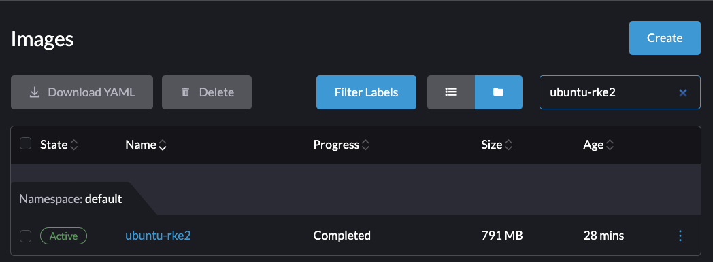

# Packer builder for Harvester
Use Harvester to run a qemu instance container to build a custom VM. Right now its a Pod but I'll convert it to a Job in the future.

For those not aware, Packer is a tool by [Hashicorp](https://www.packer.io/) used to build Virtual Machine images programmatically. What usually ends up as a manual process with an error-prone checklist that an operator follows to create an approved VM image can be translated into pure code. Yes, this includes interacting with UI elements. Packer can build VM images starting with official release installation ISOs that you might see from Canonical or Rocky and generate a variety of formats of VM images (including moving them around and publishing them). This also includes CSPs such as AWS and Azure.

Ensure your kubecontext is pointed at your Harvester cluster. Most of the configuration is default configured, but you can edit [builder.yaml](./builder.yaml) to feed environment variables into the packer command if you wish to customize off of ubuntu. At some point I'll make that a feature but for right now this a PoC for building a customized Ubuntu-based VM image that sources the cloud image from Canonical.

Edit your [recipe.yaml](./recipe.yaml) file to suit your custom VM image (its a cloud-init). Default passwords and such do not persist.


# Howto

## Building the Image
I have greatly simplified how this works. It is no longer spinning up a base VM to run packer within (to spin up yet another VM) but is instead using a Harvester container image that has KVM support built in.

Run the build script:
```bash
./build.sh
```

```console
$ ./build.sh
Building recipe:
#cloud-config
ssh_pwauth: True
package_update: true
packages:
- qemu-guest-agent
password: superpassword
chpasswd: { expire: False }
ssh_pwauth: True
runcmd:
- - systemctl
  - enable
  - '--now'
  - qemu-guest-agent.service
- mkdir -p /var/lib/rancher/rke2-artifacts && wget https://get.rke2.io -O /var/lib/rancher/install.sh && chmod +x /var/lib/rancher/install.sh


Packaging Builder environment
...
Installed plugin github.com/hashicorp/qemu v1.1.0 in "/root/.config/packer/plugins/github.com/hashicorp/qemu/packer-plugin-qemu_v1.1.0_x5.0_linux_amd64"
file.user_data: output will be in this color.
file.meta_data: output will be in this color.
image_build.qemu.ubuntu_cloud: output will be in this color.

==> file.user_data: Copying /root/builder/recipe.yaml to user-data
==> image_build.qemu.ubuntu_cloud: Retrieving ISO
==> file.user_data: Copied 365 bytes
==> image_build.qemu.ubuntu_cloud: Trying https://cloud-images.ubuntu.com/jammy/current/jammy-server-cloudimg-amd64.img
==> image_build.qemu.ubuntu_cloud: Trying https://cloud-images.ubuntu.com/jammy/current/jammy-server-cloudimg-amd64.img?checksum=sha256%3Aceacfb01f542b1eb3b08651cc9ea9e90611ad3790a3e7eeac6f76fd553c76fe3
==> file.meta_data: Running local shell script: /tmp/packer-shell1969503271
==> file.user_data: Running local shell script: /tmp/packer-shell4257198905
==> file.user_data: Total translation table size: 0
==> file.user_data: Total rockridge attributes bytes: 363
==> file.user_data: Total directory bytes: 0
==> file.user_data: Path table size(bytes): 10
==> file.user_data: Max brk space used 0
==> file.meta_data: Total translation table size: 0
==> file.user_data: 183 extents written (0 MB)
==> file.meta_data: Total rockridge attributes bytes: 363
==> file.meta_data: Total directory bytes: 0
Build 'file.user_data' finished after 9 milliseconds 455 microseconds.
==> file.meta_data: Path table size(bytes): 10
==> file.meta_data: Max brk space used 0
==> file.meta_data: 183 extents written (0 MB)
Build 'file.meta_data' finished after 10 milliseconds 107 microseconds.
==> image_build.qemu.ubuntu_cloud: https://cloud-images.ubuntu.com/jammy/current/jammy-server-cloudimg-amd64.img?checksum=sha256%3Aceacfb01f542b1eb3b08651cc9ea9e90611ad3790a3e7eeac6f76fd553c76fe3 => /root/.cache/packer/0b7d80d7324e6553599ac502e355971e2b600757.iso
...
    image_build.qemu.ubuntu_cloud: --2024-04-10 02:04:25--  https://get.rke2.io/
    image_build.qemu.ubuntu_cloud: Resolving get.rke2.io (get.rke2.io)...
==> image_build.qemu.ubuntu_cloud: Gracefully halting virtual machine...
==> image_build.qemu.ubuntu_cloud: 2024-04-10 02:04:31,883 - subp.py[WARNING]: skipping /etc/cloud/clean.d/README as its not executable or the underlying file system is mounted without executable permissions.
==> image_build.qemu.ubuntu_cloud: Converting hard drive...
==> image_build.qemu.ubuntu_cloud: Running post-processor:  (type shell-local)
==> image_build.qemu.ubuntu_cloud (shell-local): Running local shell script: /tmp/packer-shell710318884
Build 'image_build.qemu.ubuntu_cloud' finished after 3 minutes 25 seconds.

==> Wait completed after 3 minutes 25 seconds

==> Builds finished. The artifacts of successful builds are:
--> file.meta_data: Stored file: meta-data
--> image_build.qemu.ubuntu_cloud: VM files in directory: output/
--> image_build.qemu.ubuntu_cloud: VM files in directory: output/
--> file.user_data: Stored file: user-data
Defaulted container "keepalive" out of: keepalive, build (init)
pod "builder-pod" deleted

Image located here: ubuntu-jammy-rke2-amd64.img

```

Ensure your image copied successfully, it would be `ubuntu-jammy-rke2-amd64.img` in the above example. If you need more logs, add PACKER_LOG to the packer commands in [builder.yaml](./builder.yaml)

## Deploying the Image
Use the [upload.sh](./upload.sh) script to deploy the image to Harvester. You will need to supply environment variables to run this script. Note that this script can be incorporated into a post-install step in Packer but I chose to keep it external on purpose to avoid crossing scope boundaries and highlight the steps occuring in this process.

* HARVESTER_VIP = your Harvester's Virtual IP (VIP)
* HARVESTER_PASSWORD = your Harvester's admin-user password

Usage is very simple from the command-line:
```bash
HARVESTER_VIP=10.10.0.10 HARVESTER_PASSWORD=mypassword ./upload.sh
```

```console
> HARVESTER_VIP=10.10.0.10 HARVESTER_PASSWORD=mypassword ./upload.sh
Acquiring API Token
Creating VM Image object
Wait for Longhorn backend to open reader pod
Uploading ubuntu-rke2
Image successfully uploaded
```

Verify your image is in Harvester via the UI:



# Conclusion

You've now built a VM image programmatically instead of manual point and clicking! This opens up a whole world of automation and security enhancements (think of how powerful attestation reports can be here for your compliance/assurance needs). Packer can do all sorts of cool things (checksum generation for example), I encourage you to explore the tool! 

If you need to add more to your custom VM image, you don't even need to use tools like Ansible here, just update the [recipe.yaml](./recipe.yaml) and build again! Cloud Init allows for a huge amount of customization prior to ever consuming the actual VM image in your production workstreams.

Also, don't forget that [Hauler](https://rancherfederal.github.io/hauler-docs/docs/guides-references/hauler-content/files) can fetch VM image files for you. So add this local file into your Hauler store and pull it into your airgap!